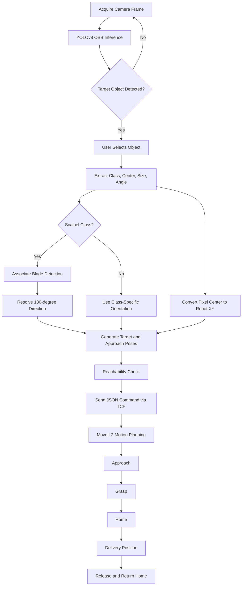

# Vision-based Robotic Adaptive Grasping System using Deep Learning

**Date:** 2026.06.16 
**Authors:** Ryu Minseo (22100252), Kim Yechan (22100153)
**Demo Video:** [2026DLIP_FinalProject_22100153_Yechan Kim_22100252_Minseo Ryu - YouTube](https://youtu.be/696Fa_Nqc_U)
**Repository / Dataset Link:** https://universe.roboflow.com/-a5j3g/final_project-mw5r4

---

## I. Introduction

- **Background and System Overview**

Accurate recognition and delivery of surgical tools are important for improving efficiency and reducing unnecessary interaction in medical environments. To perform this task autonomously, a robotic system must identify the requested tool, estimate its position and orientation, and generate an appropriate grasping motion.

This project presents a vision-based robotic system for recognizing, locating, grasping, and delivering surgical tools. The system combines an overhead camera, a YOLOv8 Oriented Bounding Box (OBB) detector, camera-to-robot coordinate transformation, and a PiPER robotic arm. The OBB detector was selected because surgical tools such as scalpels are elongated objects whose orientation is important for reliable grasping.

- **Challenges and Main Results**

A major challenge was converting the visual detection results into accurate and consistent robot grasp poses. In particular, the system needed to estimate not only the location of each object but also the direction in which a scalpel should be delivered. To address this problem, an orientation-correction method and class-specific grasping strategies were integrated into the robotic pipeline.

The final model achieved an mAP@0.5 of 0.995 on the validation dataset. In 30 integrated-system trials, the robot achieved a grasping success rate of 90%, demonstrating that the vision, calibration, pose-estimation, and robot-control modules were successfully integrated.

---

## II. Problem Statement

#### 1. Project Objectives

This project aims to develop a vision-based robotic system that can recognize, locate, grasp, and deliver selected surgical tools.

The main objectives are to:

- Detect and classify scalpels, blades, and bottles using a YOLOv8 OBB model.
- Estimate object positions and orientations in the robot coordinate system.
- Resolve the directional ambiguity of scalpels.
- Generate class-specific grasp poses by adjusting the gripper orientation and approach motion according to the object type.
- Control a PiPER robotic arm to grasp and deliver the selected object.

#### 2. Expected Outcomes

The expected outcomes are:

- A trained OBB detection model for five object classes.
- A camera-to-robot calibration and pose-estimation module.
- An integrated camera and robot-control system.
- Quantitative evaluation of detection accuracy and robotic grasping performance.

#### 3. Evaluation Index

**Vision Model — Classification (YOLOv8s-OBB)**

| Metric                | Definition                                                            | Target |
| --------------------- | --------------------------------------------------------------------- | ------ |
| mAP@0.5 (overall)     | Mean Average Precision across all classes at IoU threshold 0.5        | ≥ 0.90 |
| AP@0.5 — Blade        | Per-class Average Precision at IoU 0.5 for Blade                      | ≥ 0.88 |
| AP@0.5 — bottle       | Per-class Average Precision at IoU 0.5 for bottle                     | ≥ 0.88 |
| AP@0.5 — scalpel10    | Per-class Average Precision at IoU 0.5 for scalpel10                  | ≥ 0.88 |
| AP@0.5 — scalpel11    | Per-class Average Precision at IoU 0.5 for scalpel11                  | ≥ 0.88 |
| AP@0.5 — scalpel15    | Per-class Average Precision at IoU 0.5 for scalpel15                  | ≥ 0.88 |
| Best F1 score         | Harmonic mean of precision and recall at optimal confidence threshold | ≥ 0.95 |
| Overall Precision     | Ratio of true positive detections to all positive predictions         | ≥ 0.95 |
| Cross-class confusion | Number of misclassifications between object classes                   | 0      |

**Vision Model — Angle Estimation (OBB)**

> Evaluation condition: 7 angles (0°, 30°, 60°, 90°, −30°, −60°, −90°), 15 measurements each, 105 total

| Metric             | Definition                                                     | Target |
| ------------------ | -------------------------------------------------------------- | ------ |
| Mean angular error | Mean of \|GT − predicted angle\| across all measurements       | ≤ 5°   |
| RMSE (angle)       | Root Mean Square Error of angular predictions                  | ≤ 5°   |
| Max angular error  | Maximum single-measurement angular error across all conditions | ≤ 10°  |
| Detection rate     | Ratio of successful detections per condition                   | 15/15  |
| Mean confidence    | Average model confidence score during angle estimation         | ≥ 0.70 |

**Camera–Robot Calibration**

> Evaluation method: Pixel-to-robot coordinate transformation error measured at 9 reference points (P1–P9)

| Metric              | Definition                                               | Target |
| ------------------- | -------------------------------------------------------- | ------ |
| Mean position error | Mean transformation error across 9 reference points      | ≤ 5 mm |
| RMSE (position)     | Root Mean Square Error of coordinate transformation      | ≤ 5 mm |
| Max position error  | Maximum single-point transformation error among 9 points | ≤ 5 mm |

**Robot Grasping**

> Evaluation condition: 30 repeated trials on the fully integrated system

| Metric                  | Definition                                                  | Target |
| ----------------------- | ----------------------------------------------------------- | ------ |
| Grasping success rate   | Ratio of successful grasps out of 30 trials                 | ≥ 90%  |
| Mean angular error      | Mean alignment angle error during grasping                  | ≤ 5°   |
| Centroid position error | Error between estimated and actual object centroid position | ≤ 5 mm |
| Number of trials        | Total number of grasping attempts used for evaluation       | 30     |

---

## III. Requirements

#### 1. Hardware List

| Hardware                             | Purpose                                     |
| ------------------------------------ | ------------------------------------------- |
| PiPER 6-DOF robotic arm with gripper | Grasping and delivering the selected object |
| Overhead camera                      | Workspace image acquisition                 |
| Windows PC with NVIDIA GPU           | YOLO inference and camera processing        |
| CAN interface                        | Communication with the PiPER robot          |

#### 2. Software List

| Software / Library           | Purpose                                        |
| ---------------------------- | ---------------------------------------------- |
| Python 3                     | Main implementation language                   |
| Ultralytics YOLOv8 / PyTorch | OBB model training and inference               |
| OpenCV / NumPy               | Image processing and coordinate transformation |
| Spinnaker SDK / PySpin       | Camera interface                               |
| ROS 2 / MoveIt 2             | Robot control and motion planning              |
| WSL 2                        | Linux environment for ROS 2 execution          |

#### 3. Dataset

A custom dataset was created specifically for the surgical-tool grasping environment used in this project. Since publicly available datasets did not sufficiently represent the target objects, camera viewpoint, workspace background, and object arrangements used in the robotic system, all images were collected and annotated by the project team. Especially, Unlike conventional horizontal bounding boxes, oriented bounding boxes preserve the rotation angle of elongated objects and are therefore suitable for estimating scalpel orientation.

##### 3.1 Dataset Classes

The dataset consists of five classes:

| Class       | Role in the System                                           |
| ----------- | ------------------------------------------------------------ |
| `Blade`     | Auxiliary class used to determine the blade-facing direction |
| `bottle`    | Object requiring a different grasp pose from scalpels        |
| `scalpel10` | Scalpel type No. 10                                          |
| `scalpel11` | Scalpel type No. 11                                          |
| `scalpel15` | Scalpel type No. 15                                          |

```
nc: 5

names:
  0: Blade
  1: bottle
  2: scalpel10
  3: scalpel11
  4: scalpel15
```

The `Blade` class was labeled separately because the oriented bounding box of a scalpel provides its axis orientation but cannot distinguish which end contains the blade. Detecting the blade as an additional class allows the system to determine the delivery direction of each scalpel.

##### 3.2 Image Collection

Approximately 548 original images were collected. The image set was designed to include both individual objects and more complex multi-object arrangements.

The original dataset included:

- Approximately 120 images for each scalpel type
- Approximately 40 images containing two scalpels together with a bottle
- Approximately 40 images containing three scalpels together with a bottle
- Additional images with variations in object position, rotation, spacing, and arrangement

The multi-object images were intentionally included to simulate a more realistic 


##### 3.3 Data split

First, the Train, validation, and test datasets were divided from the total dataset of 548 images in an 8:1:1 ratio.

- Training set: 80%
- Validation set: 10%
- Test set: 10%

$$
N_{\text{train,original}}=435,    N_{\text{validation}}=55,        N_{\text{test}}=55
$$

##### 3.4 Data Augmentation

To improve robustness to lighting variations, brightness augmentation was applied to the test dataset. For each original image, two additional versions were generated:

- Brightness decreased by approximately 20%
- Brightness increased by approximately 20%

As a result, each original image produced three image variations, including the original image. This augmentation was applied to help the model maintain stable detection performance under different illumination conditions.

$$
N_{\text{train}} = 3 \times N_{\text{train,original}}=3\times 435=1305
$$

$$
N_{\text{total}} = N_{\text{train}}+N_{\text{validation}}+N_{\text{test}}=1305+55+55=1415
$$

With approximately 550 original images, the expected augmented dataset size is approximately 1,650 images.


---

## IV. Installation and Procedure

#### 1. Hardware Setup

The system consists of an overhead camera, a PiPER robot arm with a gripper, and a workspace containing the target objects.

Before operation:

1. Fix the camera above the workspace and complete camera calibration.
2. Connect the PiPER robot, gripper, and CAN interface to the control computer.
3. Place the target objects within the reachable workspace.
4. Move the robot to the predefined home configuration.
5. Confirm that the emergency-stop mechanism is accessible.

<div align="center">  </div>

<div align="center">
  
</div>

<div align="center">
  
</div>

#### 2. Software Setup

The vision system requires Python packages for object detection and image processing, including Ultralytics YOLO, OpenCV, and NumPy. A Spinnaker-compatible camera additionally requires the FLIR Spinnaker SDK and Python binding.

The robot control environment requires:

- ROS 2
- MoveIt 2
- PiPER ROS package
- `pymoveit2`
- CAN interface configuration

Before running the complete system, activate the CAN interface and launch the PiPER robot driver and MoveIt 2 environment. 

#### 3. Data Preparation

Top-view images were collected for five target classes under various positions, rotations, scales, and background conditions. Each object was annotated using an oriented bounding box and saved in the YOLO OBB format.

```
class_id x1 y1 x2 y2 x3 y3 x4 y4
```

The dataset was divided into training, validation, and test sets, and the corresponding paths and class names were defined in `dataset_v2.yaml`.

To improve robustness to arbitrary object orientations, rotation, scaling, flipping, and mosaic augmentation were applied during training. In particular, a rotation range of up to 180° was used because the objects could appear at any in-plane angle.

#### 4. Model Training

The detector was initialized from the pretrained `yolov8s-obb.pt` checkpoint and trained for up to 150 epochs using 640 × 640 images.

Key settings included:

- Batch size: 16
- Early-stopping patience: 30
- Random seed: 42
- GPU training
- Disk caching

The best-performing checkpoint was saved as:

```
weights/best.pt
```

#### 5. Model and System Testing

The trained model was evaluated using the validation and test datasets. The evaluation included:

- mAP@0.5
- mAP@0.5:0.95
- Per-class mAP@0.5

The best checkpoint, `weights/best.pt`, was then integrated with the camera and robot control system.

During the integrated test, the camera captured the workspace and detected the target objects. After the user selected an object, its position and orientation were transmitted to the robot controller. The robot then executed the following sequence:

```
Detection → Target Selection → Approach → Grasp
→ Home → Place → Release → Return
```

The camera program was executed on Windows, while the robot driver, MoveIt 2, and robot control program were executed in WSL.

---

## V. Method

### 1. Overview

The system consists of four primary modules:

1. **Object-detection module**
2. **Camera-to-robot calibration module**
3. **Grasp-pose generation module**
4. **Robot-control module**



#### 2. Vision-Based Object Detection

##### 2.1 Image Acquisition

The camera module acquires a top-view image of the workspace through the Spinnaker SDK. An OpenCV-compatible camera can also be used as a fallback.

Each image is passed to the YOLOv8-OBB model and resized internally to 640 × 640 pixels during inference.

<div align="center">
  
</div>

##### 2.2 YOLOv8-OBB Detection

The project uses the pretrained **YOLOv8s-OBB** model provided by Ultralytics. Unlike a horizontal bounding box, an oriented bounding box represents an object using a rotated rectangle, allowing the system to estimate the orientation of long and narrow objects such as scalpels.

For each detected object, the model outputs:

- Class name
- Confidence score
- Center coordinate ($c_x,c_y$)
- Width and height
- OBB angle
- Four corner points

Only detections with confidence scores greater than 0.75 are used for robot control.

The OBB representation is defined as:

$$
(c_x,c_y,w,h,\theta)
$$

where ($\theta$) represents the object orientation.

However, the OBB major-axis angle is periodic over 180 degrees. Therefore, the OBB alone cannot determine which end of a scalpel contains the blade. An additional blade-direction estimation method is used to resolve this ambiguity.

<div align="center">
  
</div>

#### 3. Coordinate Transformation and Grasp-Pose Generation

##### 3.1 Camera-to-Robot Homography Transformation

The camera image and robot workspace use different coordinate systems. To convert an image coordinate ((u,v)) into a robot-plane coordinate ((X,Y)), nine corresponding reference points were collected.

The transformation is expressed as:

$$
H
\begin{bmatrix}
u\
v\
1
\end{bmatrix}
]
$$

where (H) is a (3 \times 3) homography matrix.

The matrix was calculated using OpenCV's `findHomography()` function with RANSAC. Nine points distributed across the workspace were used to improve calibration coverage and reliability.

Calibration accuracy was evaluated using:

- Mean reprojection error
- Root mean square error
- Maximum reprojection error

The resulting matrix was saved as `homography.npy` and applied during runtime using `perspectiveTransform()`.

<div align="center">
  
</div>

<div align="center">
  
</div>

##### 3.2 OBB Angle-to-Robot Yaw Conversion

The detected OBB angle was converted from radians to degrees and adjusted to match the robot yaw convention.

$$
\psi =
-\left(
\theta_{\mathrm{OBB}}
+\theta_{\mathrm{global}}
+\theta_{\mathrm{class}}
\right)
$$

The yaw angle was normalized to approximately ([$-90^\circ,90^\circ$]). A global offset of ($-3^\circ$) was applied to compensate for systematic alignment error.

##### 3.3 Blade-Direction Estimation

For scalpel classes, the detected `Blade` region was associated with the corresponding scalpel OBB.

Let the vector from the scalpel center to the blade center be:

$$
\mathbf{d} =
\begin{bmatrix}
c_{x,\mathrm{blade}}-c_{x,\mathrm{scalpel}}\
c_{y,\mathrm{blade}}-c_{y,\mathrm{scalpel}}
\end{bmatrix}
$$

The major-axis unit vector of the scalpel OBB is:

$$
\mathbf{a} =
\begin{bmatrix}
\cos\theta\
\sin\theta
\end{bmatrix}
$$

The sign of the dot product

$$
\mathbf{d}\cdot\mathbf{a}
$$

indicates which end of the scalpel contains the blade. Based on this result, the system adjusts the final grasp and delivery orientation.

<div align="center">
  
</div>

<div align="center">
  
</div>

##### 3.4 Class-Specific Grasp-Pose Generation

Different object classes require different gripper orientations and target heights.

| Object type | Grasp orientation                    | Target Z |
| ----------- | ------------------------------------ | -------- |
| Scalpel     | Top-down grasp, pitch (=$180^\circ$) | 135 mm   |
| Bottle      | Angled grasp, pitch (=$120^\circ$)   | 100 mm   |

For scalpels, an approach pose was generated 60 mm above the target pose. For the bottle, an additional radial X-direction offset was applied to improve the approach geometry.

#### 4. Safety and Camera-Robot Communication

##### 4.1 Reachability and Safety Check

Before a target command is transmitted, the target position is checked against the robot workspace.

The camera-side planner rejects the target if:

- The Euclidean distance exceeds 627 mm
- The target Z position is below the configured minimum

The robot-side controller additionally includes:

- Minimum-Z validation
- Multiple motion-planner fallbacks
- Keyboard emergency stop using the `s` key
- Return-to-home behavior after failure

#### 4.2 Camera-Robot State Machine

The camera application is organized into four states:

| State     | Description                                        |
| --------- | -------------------------------------------------- |
| `IDLE`    | Detects and displays objects continuously          |
| `INPUT`   | Freezes the image and waits for object selection   |
| `PLAN`    | Calculates target, approach, and delivery poses    |
| `WAITING` | Waits for the robot completion or failure response |

The camera and robot applications communicate through a TCP socket on port 7777 using JSON messages.

The transmitted command contains the target position, grasp orientation, approach pose, and object information required by the robot controller.

#### 5. Robot Motion Execution

After receiving a valid command, the robot controller executes the following sequence:

```
Open Gripper
→ Move to Approach Pose
→ Move to Grasp Pose
→ Close Gripper
→ Return Home
→ Move to Delivery Pose
→ Release Object
→ Return Home
```

MoveIt 2 is used for motion planning. The controller attempts the following planners sequentially:

1. RRTConnect
2. BiTRRT
3. LBKPIECE

If one planner fails, the next planner is attempted. If all planning attempts fail or an emergency stop is triggered, the robot returns to the home position and sends a failure response to the camera application.

#### 5. Experiment Method

##### 5.1 Vision-Model Evaluation

The final YOLOv8-OBB model was evaluated on a separate validation dataset using:

- mAP@0.5
- mAP@0.5:0.95
- Precision
- Recall
- F1 score
- Confusion matrix
- Per-class AP@0.5

These metrics were used to evaluate both overall detection performance and class-level recognition accuracy.

#### 5.2 Integrated Robot Evaluation

The complete robot system was evaluated through 30 repeated trials.

Each trial assessed:

1. Object detection and classification
2. Grasp-position validity
3. Grasp success
4. Gripper-orientation accuracy
5. Object delivery success

The main system-level metrics were:

$$
\text{Grasp Success Rate} = \frac{\text{Successful Grasps}}{\text{Total Trials}} \times 100
$$

$$
\text{Angle Error} = \left| \theta_{\text{object}} - \theta_{\text{gripper}} \right|
$$

$$
\text{Position Error} = \sqrt{(X_{\text{estimated}} - X_{\text{actual}})^2 + (Y_{\text{estimated}} - Y_{\text{actual}})^2}
$$

The angular error measured the difference between the detected object orientation and the robot gripper orientation. The centroid-position error measured the distance between the estimated robot-coordinate position and the actual object position.

---

## VI. Results and Analysis

#### 1. Vision-Model Results : Classification

The final YOLOv8s-OBB model achieved an **mAP@0.5 of 0.995** on the validation dataset. The precision-recall curve shows an AP@0.5 of 0.995 for every class.

| Metric                | Result                   |
| --------------------- | ------------------------:|
| mAP@0.5               | 0.995                    |
| mAP@0.5 — `Blade`     | 0.995                    |
| mAP@0.5 — `bottle`    | 0.995                    |
| mAP@0.5 — `scalpel10` | 0.995                    |
| mAP@0.5 — `scalpel11` | 0.995                    |
| mAP@0.5 — `scalpel15` | 0.995                    |
| Best overall F1 score | 0.99 at confidence 0.654 |
| Overall precision     | 1.00 at confidence 0.856 |

##### 1.1 F1-Confidence Analysis

The F1-confidence curve shows that the combined model reaches a maximum F1 score of **0.99 at a confidence threshold of 0.654**. The F1 score remains close to 1.0 across a broad confidence range before decreasing rapidly above approximately 0.8.

This indicates that the model is not highly sensitive to small changes in the confidence threshold within the stable operating range. A threshold near 0.65 provides the best balance between precision and recall according to the validation curve.

<div align="center">
  
</div>

##### 1.2 Precision-Confidence Analysis

The precision-confidence curve shows that overall precision reaches **1.00 at a confidence threshold of 0.856**. Increasing the threshold removes lower-confidence predictions and therefore improves precision. However, excessively increasing the threshold also lowers recall, as shown by the recall-confidence curve.

The final runtime code uses a confidence threshold of **0.75**, which is slightly higher than the F1-optimal threshold of 0.654. This is a reasonable conservative choice for robotic grasping because a false positive may cause the robot to move toward an incorrect target. Nevertheless, the threshold should be validated using real-world robot trials rather than selected only from the validation curves.

<div align="center">
  
</div>

##### 1.3 Precision-Recall Analysis

The precision-recall curve remains close to the upper-right boundary for all five classes. Each class achieved an AP@0.5 of **0.995**, resulting in an overall mAP@0.5 of **0.995**.

This result indicates that the model maintained both high precision and high recall over the validation dataset. The almost rectangular shape of the curve suggests that the target classes were visually well separated under the evaluated conditions.

<div align="center">
  
</div>

##### 1.4 Recall-Confidence Analysis

The recall-confidence curve shows that recall remains close to 1.0 at low and moderate confidence thresholds, but decreases rapidly when the threshold becomes too high. This behavior is expected because high thresholds reject valid detections whose confidence scores fall below the selected cutoff.

Among the classes, the bottle curve remains at high recall until a relatively high confidence threshold, while several scalpel and blade curves begin to decline earlier. Therefore, selecting a very high threshold solely to maximize precision could reduce the number of detected surgical tools.

<div align="center">
  
</div>

##### 1.5 Confusion-Matrix Analysis

The confusion matrix contains the following correctly detected validation instances:

| True class                          | Correct detections |
| ----------------------------------- | ------------------:|
| `Blade`                             | 67                 |
| `bottle`                            | 9                  |
| `scalpel10`                         | 23                 |
| `scalpel11`                         | 17                 |
| `scalpel15`                         | 27                 |
| **Total correct object detections** | **143**            |

No cross-class confusion occurred among the five object classes. In other words, a true scalpel class was not incorrectly classified as another scalpel class, bottle, or blade.

Three detections were assigned to actual background regions:

- 1 false-positive detection classified as `scalpel11`
- 2 false-positive detections classified as `scalpel15

Therefore, the remaining error was not inter-class confusion but background false positives. This suggests that adding more difficult negative-background images, especially patterns resembling `scalpel11` or `scalpel15`, may further improve practical robustness.

<div align="center">
  
</div>

The normalized confusion matrix shows a value of **1.00 on the diagonal for all five true object classes**, meaning that all annotated instances shown in this matrix were assigned to their correct class. The background false positives were divided into 0.33 for `scalpel11` and 0.67 for `scalpel15`, corresponding to one and two false-positive detections, respectively.

<div align="center">
  
</div>

##### 1.6 Interpretation and Limitations

The validation mAP@0.5 of 0.995 substantially exceeded the original target of 0.90, demonstrating strong detection and classification performance under the evaluated conditions.

However, these results were obtained using a custom dataset collected in a controlled workspace. Performance may decrease under conditions that were not sufficiently represented in the dataset, such as lighting changes, reflective backgrounds, partial occlusion, motion blur, camera displacement, or objects with different visual characteristics.

Therefore, the validation results should be interpreted as evidence of strong performance within the current experimental setup rather than guaranteed performance in all operating environments. Additional evaluation using the separate test dataset and end-to-end robot trials is required to assess practical robustness and generalization.

#### 2. Vision-Model Results : Angle Estimation

To evaluate angle prediction accuracy, the ground-truth orientation is represented on a 0°–180° scale, visualized as yellow reference lines overlaid on the camera image. The model's predicted angle, however, is normalized to a −90° to +90° range to conform to the robot's joint convention, as the gripper is physically symmetric and does not require a full 180° range. This normalization ensures that the predicted yaw angle maps directly to a valid and executable robot joint command without ambiguity.


|                | GT (deg) | avg_angle (deg) | error (deg) | signed_error (deg) | detected | mean_conf |
|:-------------- |:--------:|:---------------:|:-----------:|:------------------:|:--------:|:---------:|
| 0 Deg result   | 0.0      | 0.80            | 0.80        | +0.80              | 15/15    | 0.72      |
| 30 Deg result  | 30.0     | 29.43           | 0.57        | -0.57              | 15/15    | 0.83      |
| 60 Deg result  | 60.0     | 59.70           | 0.30        | -0.30              | 15/15    | 0.84      |
| 90 Deg result  | 90.0     | 90.43           | 0.43        | +0.43              | 15/15    | 0.87      |
| -30 Deg result | 150.0    | 150.28          | 0.28        | +0.28              | 15/15    | 0.82      |
| -60 Deg result | 120.0    | 121.65          | 1.65        | +1.65              | 15/15    | 0.82      |
| -90 Deg result | 90.0     | 90.06           | 0.06        | +0.06              | 15/15    | 0.77      |

> Mean error: $0.59\degree$  / RMSE: $0.75\degree$ / Max error: $1.65\degree$ 

#### 3. Camera-Robot System Results

##### 3.1 Camera-Robot Calibration Results

The evaluation of calibration accuracy was determined by how accurately the camera's pixel coordinate system was linked to the robot coordinate system.

| #   | Camera Coordinate[px] | Robot Coordinate[mm], (Real value) | Robot Coordinate[mm] (Calculated value) | Error(mm) |
| --- | --------------------- | ---------------------------------- | --------------------------------------- | --------- |
| P1  | (90,711)              | (200.0, 0.0)                       | (200.0, 0.5)                            | 0.46      |
| P2  | (403,712)             | (300.0, 0.0)                       | (300.3, 0.4)                            | 0.50      |
| P3  | (717,717)             | (400.0, 0.0)                       | (399.8, -1.0)                           | 1.01      |
| P4  | (99,410)              | (200.0, 100.0)                     | (199.0, 99.7)                           | 1.10      |
| P5  | (420,406)             | (300.0, 100.0)                     | (301.7, 100.6)                          | 1.80      |
| P6  | (728,407)             | (400.0, 100.0)                     | (399.1, 100.0)                          | 0.85      |
| P7  | (114,107)             | (200.0, 200.0)                     | (199.8, 199.5)                          | 0.59      |
| P8  | (429,103)             | (300.0, 200.0)                     | (300.5, 199.8)                          | 0.56      |
| P9  | (743,98)              | (400.0, 200.0)                     | (399.8, 200.6)                          | 0.59      |

> **Mean error: 0.83 mm / RMSE: 0.92 mm / Max error: 1.80 mm**

Angle accuracy was evaluated based on the difference between the actual position in the mm coordinate system and the position predicted by the model.

##### 3.2 Robot Grasping Results

The complete robotic system was evaluated through 30 repeated trials.

| Metric                  | Goal   | Result           | Goal Achieved |
| ----------------------- | ------ | ---------------- | ------------- |
| Grasping success rate   | ≥ 90%  | 90%              | Yes           |
| Mean angular error      | ≤ 5°   | Approximately 1° | Yes           |
| Centroid position error | ≤ 5 mm | Within 2 mm      | Yes           |
| Number of trials        | 30     | 30               | —             |

The system successfully completed 27 of the 30 grasping trials, resulting in a grasping success rate of 90%.

The mean angular error of approximately ($1^\circ$) indicates that the OBB angle conversion and blade-direction estimation provided sufficiently accurate gripper alignment under the tested conditions. The centroid-position error remained within 2 mm, showing that the homography transformation provided adequate positioning accuracy for the calibrated workspace.

Overall, all three target criteria were achieved.

#### 3. Integrated-System Analysis

The final system successfully integrated the complete perception-to-action pipeline:

- OBB-based object detection and classification
- Pixel-to-robot coordinate transformation
- Object-orientation and blade-direction estimation
- Class-specific grasp-pose generation
- TCP communication between the camera and robot applications
- ROS 2 and MoveIt 2-based robot motion execution

The main strength of the system is that the detected object pose is directly converted into an executable robot command. Therefore, the system performs not only object recognition but also target selection, grasp-pose generation, motion planning, grasping, and object delivery.

However, several limitations remain:

1. **Dependence on the experimental environment**
   Detection and grasping performance may decrease under lighting, background, occlusion, or camera conditions that differ from those included in the dataset and calibration setup.
2. **Planar homography assumption**
   The homography transformation is accurate mainly on the calibrated workspace plane. Changes in object height may introduce position errors because depth is not directly estimated.
3. **Manual release input**
   The release action at the delivery position still requires user input. A fully autonomous system should determine the release timing and complete the delivery sequence without manual intervention.

These results demonstrate that the proposed system can accurately recognize, locate, grasp, and deliver the target objects under the tested conditions. Further evaluation in more varied environments and full automation of the release procedure are required for practical deployment.

---

## VII. Conclusion

This project developed a vision-based robotic system for surgical-tool recognition, grasping, and delivery.

The proposed system integrates:

- YOLOv8s-OBB-based object detection and orientation estimation
- Nine-point homography calibration for pixel-to-robot coordinate conversion
- Blade-direction estimation to resolve the 180-degree scalpel-orientation ambiguity
- Class-specific grasp-pose generation
- TCP communication between the camera and robot applications
- ROS 2 and MoveIt 2-based robot motion execution

The trained model achieved an mAP@0.5 of approximately 0.99. In 30 repeated system trials, the robot achieved:

- 90% grasping success rate
- Approximately ($1^\circ$) mean angular error
- Centroid-position error within 2 mm

These results show that the perception, calibration, pose-estimation, communication, and robot-control modules were successfully integrated into a complete perception-to-action pipeline.

The main contribution of this project is that the detected object position and orientation were directly converted into executable robot grasping and delivery motions. The system therefore performs not only object recognition, but also target localization, grasp-pose generation, motion planning, grasping, and object delivery.

### Future Work

Future improvements include:

- Expanding the dataset with more varied lighting, backgrounds, and negative images
- Evaluating the model on an independent test dataset
- Measuring end-to-end latency and inference FPS
- Applying depth sensing or hand-eye calibration for objects at different heights
- Adding more detailed collision objects and workspace constraints in MoveIt 2
- Automating the release stage
- Evaluating performance separately for each object class
- Adding visual verification before and after grasping

Overall, the proposed system demonstrated reliable surgical-tool recognition, localization, grasping, and delivery under the tested conditions.

## References

[1] Ultralytics, “YOLO Documentation,” available online.

[2] OpenCV, “Geometric Image Transformations and Homography,” available online.

[3] ROS 2 Documentation, available online.

[4] MoveIt 2 Documentation, available online.

[5] PiPER ROS and MoveIt Package Repository, available online.

[6] FLIR Systems, “Spinnaker SDK Documentation,” available online.

## Appendix

#### 1. Team Contributions

**Ryu Minseo**

-Dataset Planning
-Robot Control Setup
-ROS / MoveIt 2 Integration
-Homography Calibration
-TCP-Based Camera–Robot Communication
-Grasping Algorithm Design
-Validation and System Testing

**Kim Yechan**

-Establishing the Direction for Dataset Configuration

-Dataset Configuration

-Camera-Robot System Hardware Configuration

-Machine Vision Camera System Configuration

#### 2. Key Implementation Challenges

##### Camera-to-Robot Coordinate Conversion

The camera and robot used different coordinate systems. A nine-point homography calibration was applied to convert detected pixel coordinates into robot workspace coordinates.

##### Scalpel-Direction Estimation

The OBB angle could not distinguish the blade side from the handle side. A separate `Blade` class and dot-product-based direction estimation were used to resolve the 180-degree ambiguity.

##### Camera–Robot Communication

The camera application ran on Windows, while the robot-control application ran in WSL. A TCP socket using JSON messages was implemented to transmit target poses and robot status.

##### Motion-Planning Stability

Multiple MoveIt 2 planners were attempted sequentially when motion planning failed. Reachability checks and return-to-home behavior were also included for safe recovery.

#### 3. Project Resources

The main implementation files include:

- `train_obb.py`
- `validation.py`
- `calibration.py`
- `Final_Camera.py`
- `Final_Robot.py`

A demonstration video and the complete source code are provided separately.